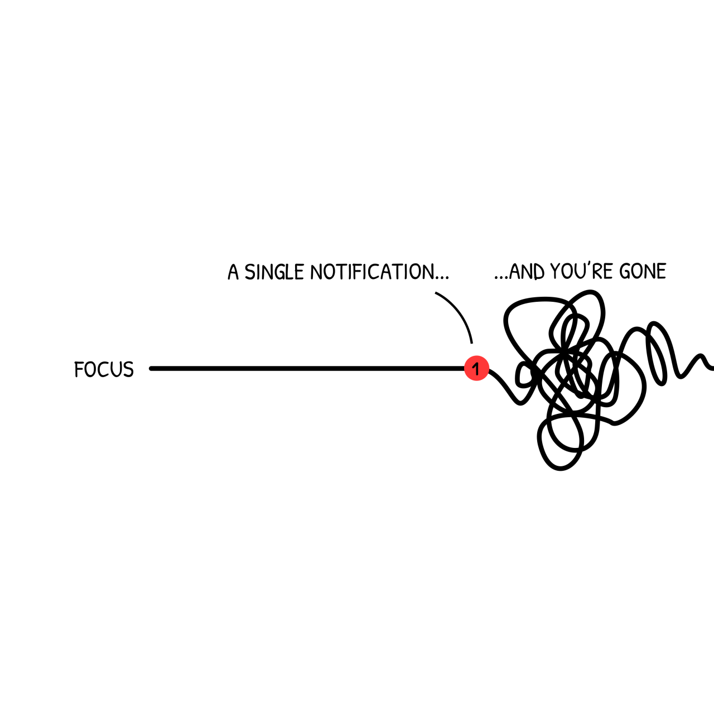

> [“Productivity depends on being able to juggle a lot of little details in short term memory all at once. Any kind of interruption can cause these details to come crashing down. When you resume work, you can’t remember any of the details (like local variable names you were using, or where you were up to in implementing that search algorithm) and you have to keep looking these things up, which slows you down a lot until you get back up to speed.” — Joel Spolsky](https://www.joelonsoftware.com/2000/04/19/where-do-these-people-get-their-unoriginal-ideas/)

---

|  |
| :-: |
| [Source](https://www.monkeyuser.com/2018/focus) |

|  |
| :-: |
| [Source](https://x.com/FerraroRoberto/status/1628991179575504896) |

---

#Newsletter

[@markCostInterruptedWork2008]

It takes the brain an average of 23 minutes and 15 seconds to refocus after a distraction / an interruption, a phenomenon known as the **“cognitive switching penalty”**.

This happens because when interrupted, the brain must re-establish context for the original task, which is a process that can take a significant amount of time.

---

# Carlson’s law

= Law of Homogeneous Sequences

by [Sune Carlson](https://en.wikipedia.org/wiki/Sune_Carlson)

> Interrupted work will always be less effective and take longer than if completed continuously.

---

# Constant interruptions for software developers are caused by:

* **Meeting overload:** When a single daily standup runs 45 minutes, 10% of your team’s workweek is gone — before factoring in all the other recurring meetings filling their calendars.
* **Calendar fragmentation:** A developer with just 90 minutes of scattered meetings throughout the day can lose 4+ hours of potential deep work due to the mental context-switching required before and after each interruption.
* **Ad-hoc communications:** Junior developers naturally reach out with a “quick” Slack message when they’re stuck, and suddenly your most experienced engineers are spending more time troubleshooting others’ problems than solving their own.

---

See also:

* Blog posts
	* [Maker’s Time v.s Manager’s Time](https://sketchplanations.com/manager-time-maker-time)
	* [Developer Flow State and Its Impact on Productivity | Stack Overflow Blog](https://stackoverflow.blog/2018/09/10/developer-flow-state-and-its-impact-on-productivity/)
	* [Context-switching is the main productivity killer for developers](https://newsletter.techworld-with-milan.com/p/context-switching-is-the-main-productivity)
	* [Programmer Interrupted: The Real Cost of Interruption and Context Switching](https://contextkeeper.io/blog/the-real-cost-of-an-interruption-and-context-switching/)
* Scientific papers
	* [@vansolingenInterruptsJustMinute1998]
	* [@czerwinskiDiaryStudyTask2004]
	* [@markNoTaskLeft2005]

---

[Parable of the Two Watchmakers](parable-of-the-two-watchmakers.md)

---

[Flow State](flow-state.md)

---

[Task Switching](task-switching.md)
