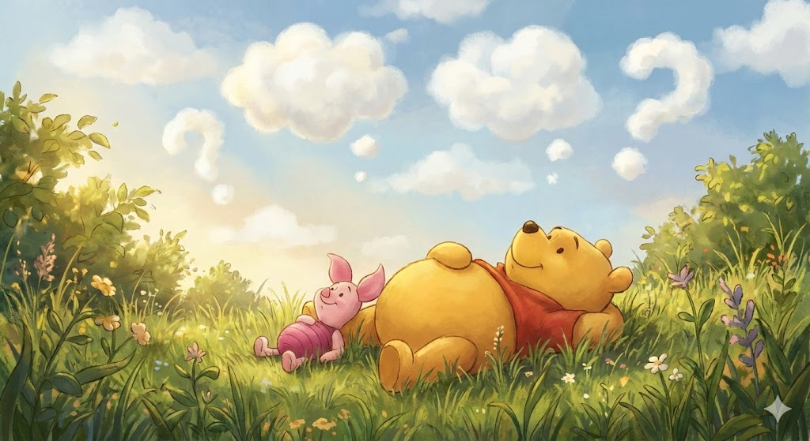

> _“Don’t underestimate the value of doing nothing, of just going along, listening to all the things you can’t hear, and not bothering.” — Winnie the Pooh_

#Newsletter

有一天，小熊維尼（Pooh）和小豬（Piglet）並肩躺在草坪上，望著天空，想著今天要做什麼。

維尼首先打破沉默：「不如去拜訪大家吧。」

小豬有點猶豫：「我們要不要想個理由？比如說，一起去冒險之類的。」

維尼搖搖頭：「理由很簡單。<mark>今天是星期四，我們去祝大家星期四快樂。</mark>」

他們來到兔子家。那位每天都忙著重要事情的兔子皺起眉頭，問：「為什麼要祝我星期四快樂？星期四會發生什麼特別的事嗎？」

維尼耐心地解釋了一遍。

兔子聽完後說：「喔，我還以為你們是為了什麼正經事來的。」

離開兔子家後，維尼沉思了一會兒，說：「兔子很聰明。」

小豬點頭：「對啊，兔子真的很聰明。」

「而且他有一個腦袋。」維尼補了一句。

「對，他有一顆腦袋。」小豬附和。

維尼沉默了很久，最後說：「<mark>也許，這就是他什麼都不懂的原因吧。</mark>」

> 兔子和維尼的思維差異在於：
>
> 兔子理性、計畫性強，總是追求生產力、目標與效率，注重「做正確的事」；
>
> 而維尼則隨性、直覺和當下導向，行動不為功利，只因「今天就是今天」，他用單純的喜悅和好奇去體驗生活，強調「存在」本身而非目的。
>
> 當維尼，而不是當兔子。
