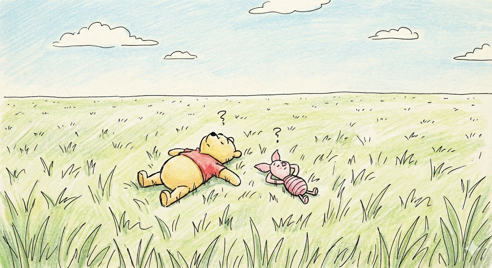

> “Don’t underestimate the value of doing nothing, of just going along, listening to all the things you can’t hear, and not bothering.” — A.A. Milne, [Winnie-the-Pooh](https://www.goodreads.com/work/quotes/1225592)

> “People say nothing is impossible, but I do nothing every day.” — A.A. Milne, [Winnie-the-Pooh](https://www.goodreads.com/work/quotes/1225592)

> “Doing nothing often leads to the very best of something.” — A.A. Milne, [Winnie-the-Pooh](https://www.goodreads.com/work/quotes/1225592)

---

#TODO Link to Newsletter #12 section

---

兔子和維尼的思維差異在於：

兔子理性、計畫性強，總是追求生產力、目標與效率，注重「做正確的事」；

而維尼則隨性、直覺和當下導向，行動不為功利，只因「今天就是今天」，他用單純的喜悅和好奇去體驗生活，強調「存在」本身而非目的。

當維尼，而不是當兔子。

---

[Wu Wei](wu-wei.md)
