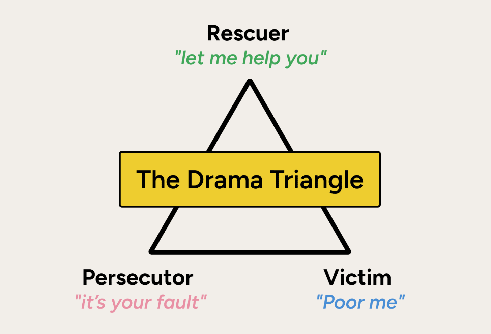

In 1968, psychiatrist [Stephen Karpman introduced the “Drama Triangle” model](https://karpmandramatriangle.com/), which describes three roles people unconsciously cycle through:

1. The **Victim** (“poor me”)
2. The **Persecutor** (“it’s your fault”)
3. The **Rescuer** (“let me help you”)

These roles are fluid and often shift. A Rescuer who feels unappreciated may become a Persecutor. A Victim who builds up enough resentment can also turn into a Persecutor. Regardless of where you start, everyone eventually feels like a victim.

|  |
| :-: |
| [Source](https://weeklyio.substack.com/p/weekly-io-129) |

In organizations, this dynamic manifests as triangulation: Person A has an issue with Person B but goes to a manager instead of speaking directly to B. The manager then inherits anxiety that belongs to A and B.

[David Emerald’s Empowerment Dynamic](https://theempowermentdynamic.com/about/) offers a practical antidote: **communicate directly**.

In this model:

* The Victim transforms into a **Creator** who asks, “What do I want?”
* The Persecutor becomes a **Challenger** who holds others accountable with care.
* The Rescuer shifts to a **Coach** who asks, “Have you spoken to them about this?”
