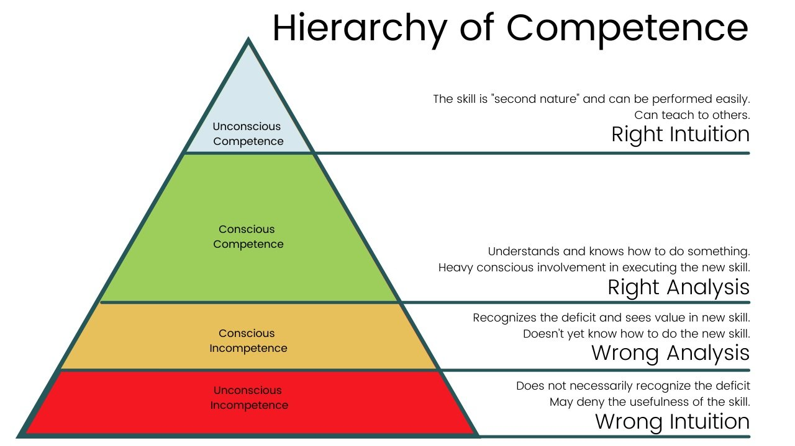
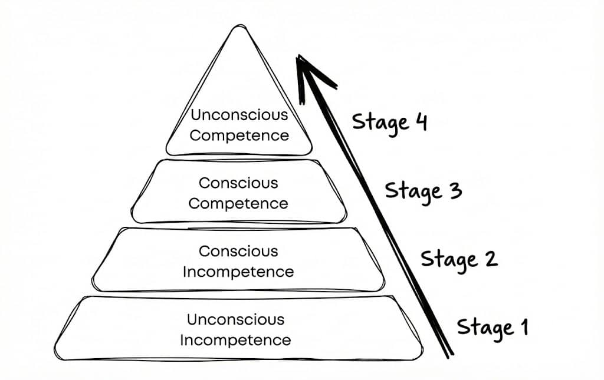

1. **Unconscious Incompetence:** Complete novice. Unaware of your own incompetence.
2. **Conscious Incompetence:** Aware of your own incompetence.
3. **Conscious Competence:** Developed competence at the craft, but execution requires significant conscious effort.
4. **Unconscious Competence:** [Sprezzatura](sprezzatura.md). Extreme competence executed without conscious effort.

---

[Four Stages of Competence](https://sketchplanations.com/stages-of-competence-framework)
