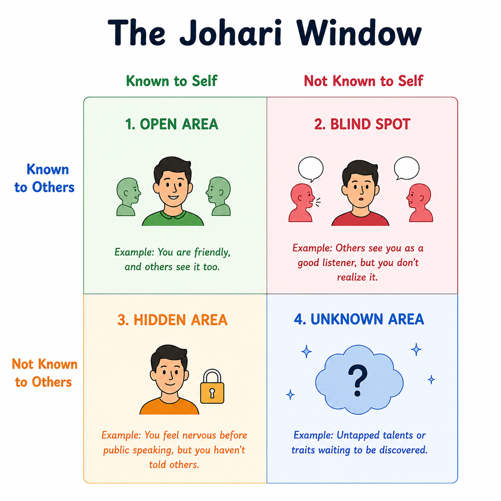

[The Johari Window](https://sketchplanations.com/johari-window) is a psychological model created in 1955 by psychologists Joseph Luft and Harrington Ingham. It represents self-awareness and interpersonal communication through a four-quadrant grid that categorizes personal traits, behaviors, and motivations based on what you and others know (or don’t know) about you.

