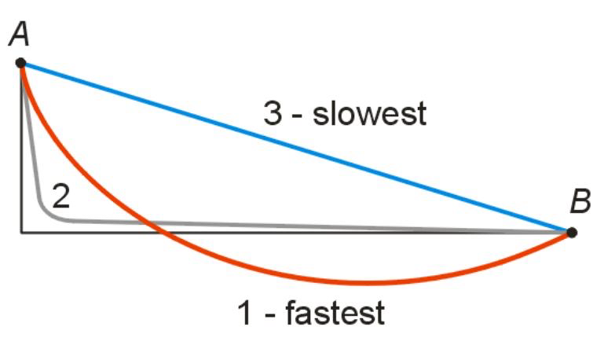

> “Sometimes taking time is actually a shortcut.” — Haruki Murakami, [What I Talk About When I Talk About Running](https://www.goodreads.com/work/quotes/2475030)

The long path is the shortcut. The [hard](do-hard-things.md) way is always the right way. [Compounding](the-compounding-effect.md) is life’s ultimate shortcut.

---

> 識得最近的路，最短也最長；而最遠的路，最長也最短。
> — 周夢蝶

有時候，花時間才是最近的捷徑。

---

> “What’s most important is what you can’t see but can feel in your heart. To be able to grasp something of value, sometimes you have to perform seemingly inefficient acts. But even activities that appear fruitless don’t necessarily end up so. That’s the feeling I have, as someone who’s felt this, who’s experienced it.” — Haruki Murakami, [What I Talk About When I Talk About Running](https://www.goodreads.com/work/quotes/2475030)
>
> 最重要的東西是那些看不見、卻能在心裡感覺到的東西。為了能抓住有價值的東西，有時候你必須去做那些看似沒有效率的事情。但即使表面上看起來徒勞無功，也不一定真的是白費力氣。這是作為一個感受過、體驗過的人，我所擁有的體會。

真正有價值的東西，往往只能透過低效率的行為獲得。

---

# 物理學上的最速降線問題

> 最快到達終點的路徑，未必是最短、最直的一條。

假設有一顆珠子從高處滑到低處，只靠重力，沒有摩擦。

直覺會認為兩點之間直線最短，所以應該最快。

但實際上不是。

最快的是一條向下凹的曲線（[Brachistochrone](https://www.google.com/search?q=Brachistochrone)）。

原因是：

* 曲線前半段更陡。
* 珠子很快獲得高速。
* 雖然後半段比較長，但一路都維持高速。
* 最後反而比直線更快抵達終點。

可以把它想成：

> 先花一點距離換取速度，再用速度追回時間。

---

# 直線（看似最快）vs 曲線（真正最快）

> 捷徑往往最繞路，迂迴之路才是真正的捷徑。

很多人追求的是：

* 最短步驟
* 最快成功
* 最直接的方法

但真正有效的人更在意的是：

* 哪條路能最快累積能力？
* 哪個技能之後能大幅加速？
* 哪個決定能降低未來成本？

例如：

* 花一年學好英文，之後閱讀世界級資料速度翻倍。
* 花幾個月建立自動化工具，每天省下一小時。
* 花時間把基礎打穩，之後學新技術比別人快得多。
