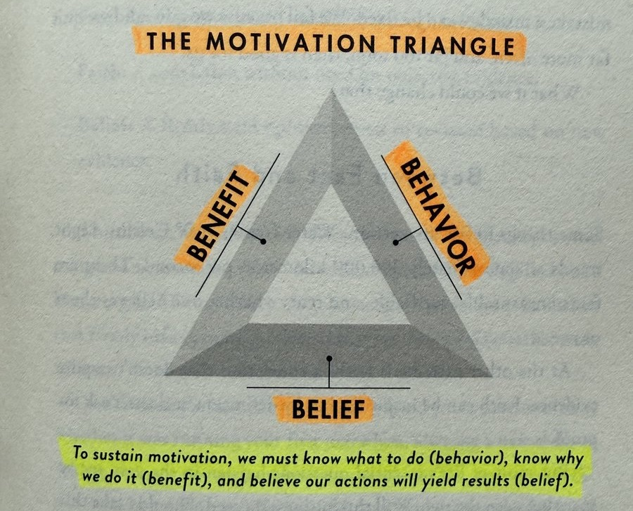

proposed by [Nir Eyal](https://www.nirandfar.com/)

Motivation requires three elements:

1. **Behavior** — What you do
2. **Benefit** — Why you do it
3. ⭐️ **Belief** — Whether you think it will work

---

Belief [^1] is the foundation of the motivation triangle that includes benefit and behavior.

Without belief, behavior and benefit collapse. If you do not believe that your action (behavior) can create your desired outcome (benefit), you simply won’t do it.

Belief is the base of the Motivation Triangle. It is the atomic variable upon which all things can be built.

---

[Never lose faith and hope](never-lose-faith-and-hope.md)

[^1]: can be categorized into (1) Limiting Beliefs (2) Liberating Beliefs
