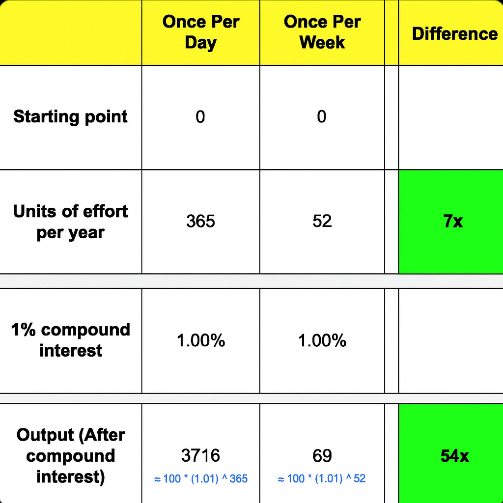

> “Tend to the small things. More people are defeated by blisters than by mountains.” — Kevin Kelly, [Excellent Advice for Living: Wisdom I Wish I’d Known Earlier](https://www.goodreads.com/work/quotes/98113859)

> “You climb as hard as you can … just advancing one inch at a time. That’s the secret of life.” — Charlie Munger

---

$1.00^{365} = 1.00$ vs $1.01^{365} = 37.8$

[The Compounding Effect](the-compounding-effect.md)

---

# “The Mamba Mentality” by Kobe Bryant

非洲草原毒蛇「黑曼巴」

> Try to get 1% better at what your are doing every single day.

---

# [“Marginal Gains” by Sir David Brailsford](https://youtu.be/THNBIQenywc)

> Pay attention to every little detail, and then trying to improve it by 1%, will have massive [compound](the-compounding-effect.md) benefits when added together in the long run.

---

# [Marginal Adjustments](https://youtu.be/TQMbvJNRpLE)

---

# Small Things Become Big Things

* [For Want of a Nail](https://huam.ing/for-want-of-a-nail)
* 涓滴成河（Kleinvieh macht auch Mist.）
* 積少成多

[Broken Windows Theory](broken-windows-theory.md)

---

# 力行、奉行每天「一點點」的哲學

* 每天一點點讀書進修
* 每天一點點肌膚保養
* 每天一點點拉筋伸展
* 每天一點點關心朋友
* 每天一點點照顧家人

[A little bit every day — Steph Ango](https://stephango.com/a-little-bit-every-day)

[A little bit of slope makes up for a lot of y-intercept](a-little-bit-of-slope-makes-up-for-a-lot-of-y-intercept.md)
