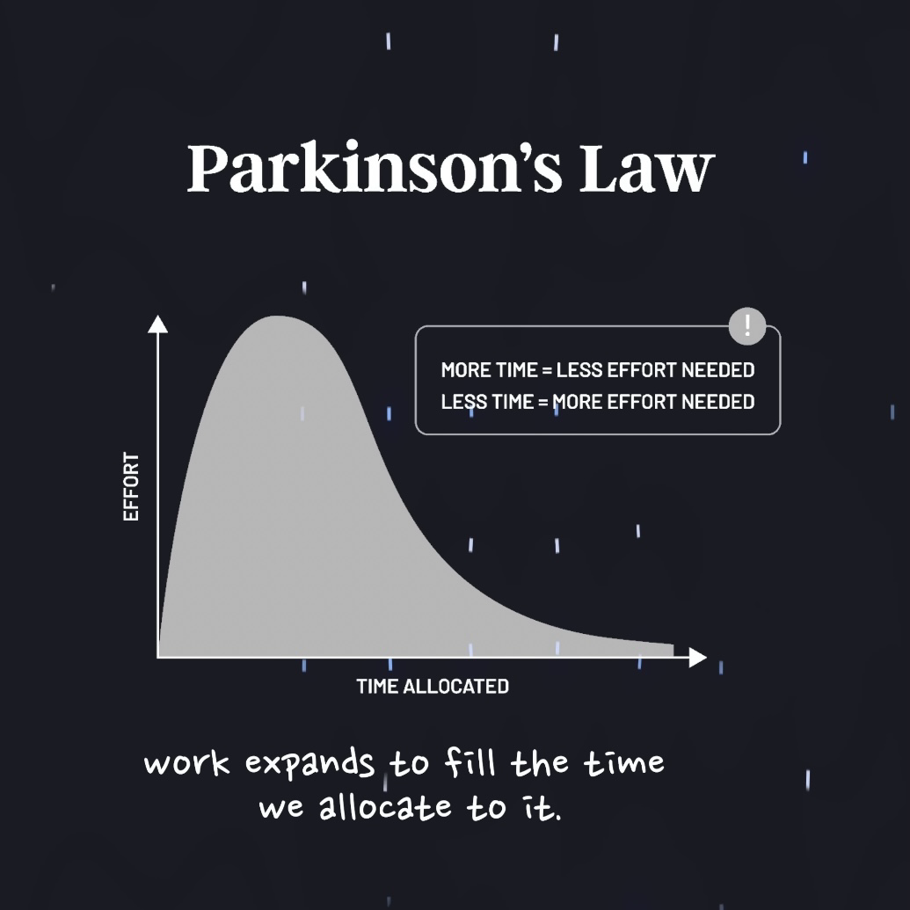
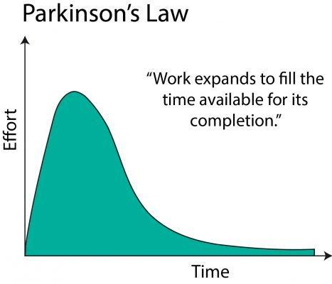
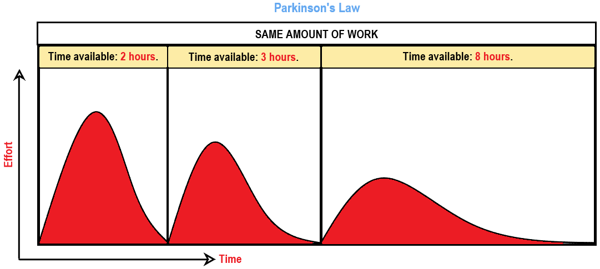

# How To Overcome It?

* Give yourself just _a little less time_ than you think you need for every task
* Fixed Schedule
	* Always demand an artificial deadline [^1] for everything you do (with a timer)

# **Why It works?**

Enforcing constraint such as time limits, creates a sense of urgency that helps to concentrate efforts

# [Related](https://sketchplanations.com/laws-of-expansion)

* Stuff expands to fill the available space
* Cost expands to fill the available budget

[^1]: If failing to do a task by a certain date has serious repercussions, then it should have a “_due date (hard deadline)_”. Otherwise, it shouldn’t.
