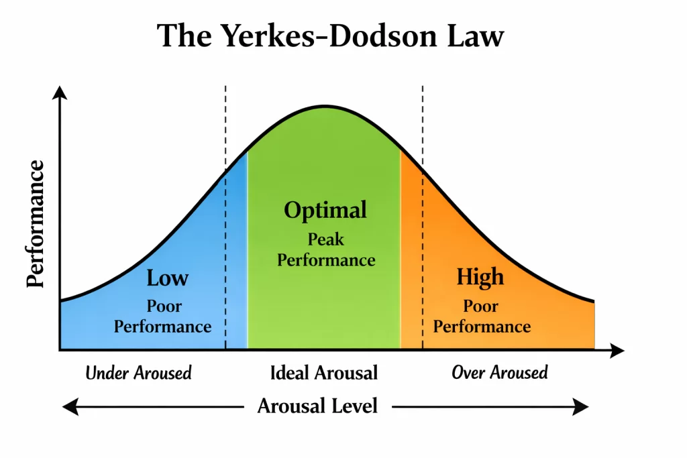

[@yerkesRelationStrengthStimulus1908]

[The Yerkes-Dodson Law](https://www.google.com/search?q=The+Yerkes-Dodson+Law) describes the relationship between arousal (or stress) and performance. It suggests that performance increases with physiological or mental arousal, but [only up to an optimal point](the-law-of-diminishing-returns.md), after which more stress actually reduces performance.

# Inverted-U Curve

The relationship is often illustrated as an inverted U-shaped curve.

* At low levels of arousal, performance is suboptimal due to lack of motivation or alertness.
* At moderate levels, performance peaks.
* At high levels, excessive stress or anxiety impairs performance.

# Task Complexity

The optimal level of arousal varies with task difficulty. Simple or routine tasks may benefit from higher arousal, while complex or unfamiliar tasks require lower arousal for best performance.

# Practical Implications

* For productivity: Find your optimal stress zone—enough to stay engaged, but not so much that you feel overwhelmed.
* For learning: Manage anxiety before exams or presentations to avoid performance drops.
* For leadership: Recognize that pushing teams too hard can backfire.
