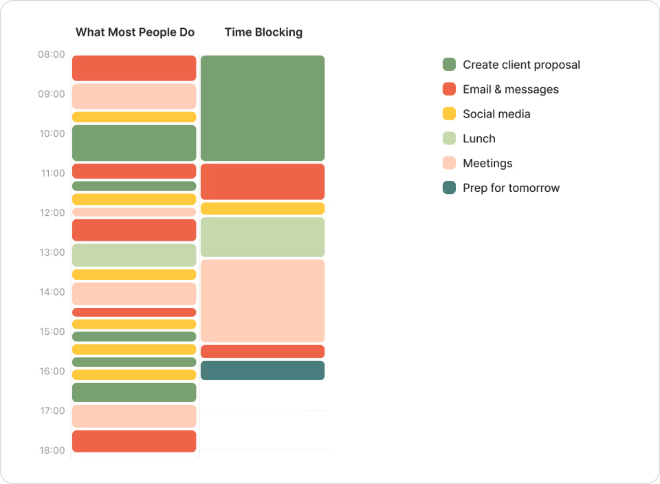

# What is Time Blocking?

[Time blocking](https://todoist.com/productivity-methods/time-blocking) (or timeboxing 時間盒子) is a [productivity](Productivity.md) technique where you divide your day into blocks of time, each dedicated to [accomplishing a specific task](you-can-achieve-anything-if-you-focus-on-one-thing-at-a-time.md) or [group of tasks](batching-emails-and-text-messages.md). Instead of working from a [to-do list](variants-of-to-do-list.md), you schedule your work on your calendar, assigning each task a start and end time.

# Why Use Time Blocking?

* **Focus:** Reduces [distractions](being-indistractable-is-superpower.md) by giving each task a dedicated slot.
* **Clarity:** Makes [priorities](Prioritization.md) visible and helps avoid overcommitting.
* **Momentum:** Encourages starting and finishing tasks within set periods, reducing procrastination.

# How to Time Block

1. **List your tasks:** [Write down everything you need to do](idea-capture-inbox.md).
2. **Estimate durations:** Decide how much time each task will take.
3. **Schedule blocks:** Place each task on your calendar, assigning a specific time slot.
4. **Include breaks:** Schedule time for [rest](the-most-productive-people-prioritize-intentional-rest.md) and buffer periods.
5. **Review and adjust:** At the end of the day, [review](reflect-and-review.md) what worked and adjust future blocks as needed.

# Practical Tips

* Use digital calendars (Apple Calendar, Google Calendar, Outlook, etc.) or paper planners.
* Color-code different types of activities (work, meetings, personal, learning).
* Be realistic—leave buffer time for unexpected interruptions.
* Protect your blocks: <mark>Treat them as appointments with yourself.</mark>
* Review your schedule daily and weekly.

---

[Deep Work](deep-work.md)

---

[The Pomodoro Technique](the-pomodoro-technique.md)

---

[The Parkinson’s Law](the-parkinsons-law.md)
