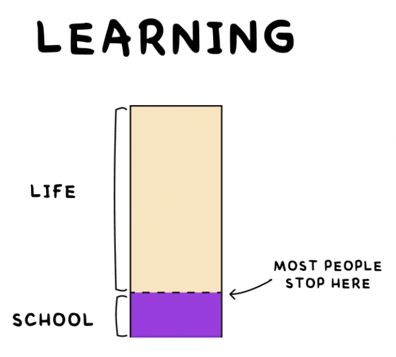

> “School is one thing. Education is another. The two don’t always overlap. Whether you’re in school or not, it’s always your job to get yourself an education.” — Austin Kleon

> “Education is what remains after one has forgotten everything he learned in school.” — Albert Einstein

> “Education is not the learning of facts, but the training of the mind to think.” — Albert Einstein

> “Education is the kindling of a flame, not the filling of a vessel.” — Socrates

> “The most important thing we learn at school is the fact that the most important things can’t be learned at school.” — Haruki Murakami, [What I Talk About When I Talk About Running](https://www.goodreads.com/work/quotes/2475030)

> “When you stop learning you start dying.” — Albert Einstein

> 「畢業是站在制度性學習的終點、自主性學習的起點。」— 龍應台

> “Live to learn and you’ll really learn to live.” — John C. Maxwell

> “Live as if you were to die tomorrow. Learn as if you were to live forever.” — Mahatma Gandhi

> [“I have never let my schooling interfere with my education.” — Mark Twain](https://www.goodreads.com/quotes/1427-i-have-never-let-my-schooling-interfere-with-my-education)

---

---

School lays the foundation, but true education starts when you step beyond the classroom.

---

# [Learning is a lifelong process.](https://hbr.org/2017/02/lifelong-learning-is-good-for-your-health-your-wallet-and-your-social-life)

凡是沒有在持續學習的人，精神上早已死去 — 只有死人才不學習。

真正的終身學習者，無論活到幾歲，大腦總是為「未知」留下一席之地，因此他們永遠年輕。

那些自稱「沒時間學習」的人，其實是選擇像機器人一樣操作眼前的生活。

有些人活著，卻如同行屍走肉，因為他們從不思考；有些人死了，卻永遠活著，因為他們的思想永存。

---

# 當知道的越多，就會發現不知道的也越多

讀書若不思考，只會讓你自以為知道很多；讀書並深思，才會讓你清楚自己所知有限。

> [“The only true wisdom is in knowing you know nothing.” — Socrates](https://www.goodreads.com/quotes/9431-the-only-true-wisdom-is-in-knowing-you-know-nothing)

> “Real knowledge is to know the extent of one’s ignorance.” [^1] — Confucius [^2] [^3]

> “The fool who knows he is a fool is that much wiser. The fool who thinks himself wise is a fool indeed.” — Buddhism

> “We are all born ignorant, but one must work hard to remain stupid.” — Benjamin Franklin

* The more you know, the more you realize you don’t know.
* The more I learn, the less I feel I know.
* The more you learn, the more you are exposed to the immense unknown.
* Experts are only aware of what they don’t know.

---

學海無涯

---

永續學習可以帶來知識再生的力量，讓我們一生保持源源不絕的學習動力。

---

[▍Do Schools Kill Creativity?](https://huami.ng/do-schools-kill-creativity)

---

[Stay curious](stay-curious.md)

[^1]: _“The greater the ignorance, the greater the dogmatism.” — William Osler_
[^2]: 知其不知，斯為知也。
[^3]: 真知者，知其所不知也。
