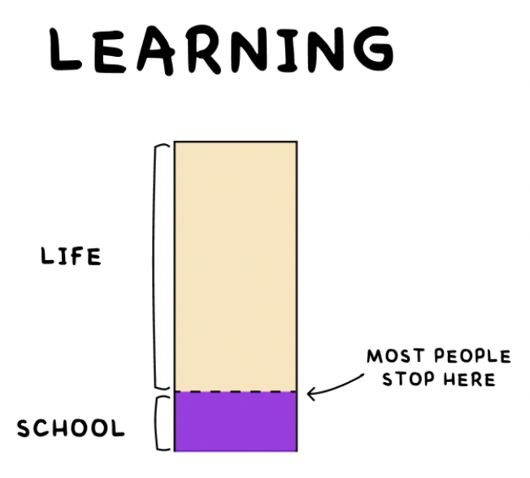

> _“School is one thing. Education is another. The two don’t always overlap. Whether you’re in school or not, it’s always your job to get yourself an education.” — Austin Kleon_

> _“Education is what remains after one has forgotten everything he learned in school.” — Albert Einstein_

> _“Education is not the learning of facts, but the training of the mind to think.” — Albert Einstein_

> _“Education is the kindling of a flame, not the filling of a vessel.” — Socrates_

> _“The most important thing we learn at school is the fact that the most important things can’t be learned at school.” ― Haruki Murakami, [What I Talk About When I Talk About Running](https://www.goodreads.com/work/quotes/2475030)_

> _“When you stop learning you start dying.” — Albert Einstein_

> _「畢業是站在制度性學習的終點，自主性學習的起點」— 龍應台_

> _“Live to learn and you’ll really learn to live.” — John C. Maxwell_

> _“Live as if you were to die tomorrow. Learn as if you were to live forever.” — Mahatma Gandhi_

---

---

School lays the foundation, but true education starts when you step beyond the classroom.

---

 [Learning is a lifelong process.](https://hbr.org/2017/02/lifelong-learning-is-good-for-your-health-your-wallet-and-your-social-life)

---

當你知道的越多，就會發現不知道的也越多

> _[“The only true wisdom is in knowing you know nothing.” — Socrates](https://www.goodreads.com/quotes/9431-the-only-true-wisdom-is-in-knowing-you-know-nothing)_

> _“Real knowledge is to know the extent of one’s ignorance .[^1]” — Confucius_ [^2] [^3]

> _“The fool who knows he is a fool is that much wiser. The fool who thinks himself wise is a fool indeed.” — Buddhism_

> _“We are all born ignorant, but one must work hard to remain stupid.” — Benjamin Franklin_

* _“The more you know, the more you realize you don’t know.”_
* The more I learn, the less I feel I know.
* The more you learn, the more you are exposed to the immense unknown.
* Experts are only aware of what they don’t know.

---

學海無涯

---

永續學習可以帶來知識再生的力量，讓我們一生保持源源不絕的學習動力。

---

# See Also

* [Stay curious](stay-curious.md)

[^1]: _“The greater the ignorance, the greater the dogmatism.” —William Osler_
[^2]: 知其不知，斯為知也。
[^3]: 真知者，知其所不知也。
