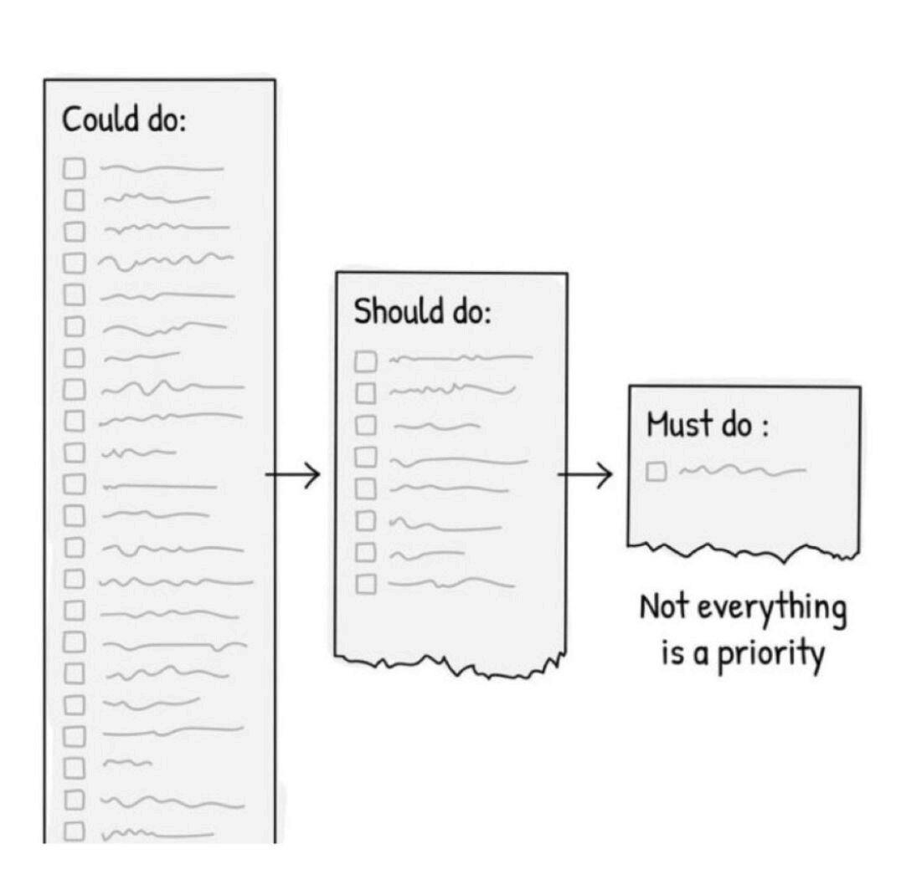
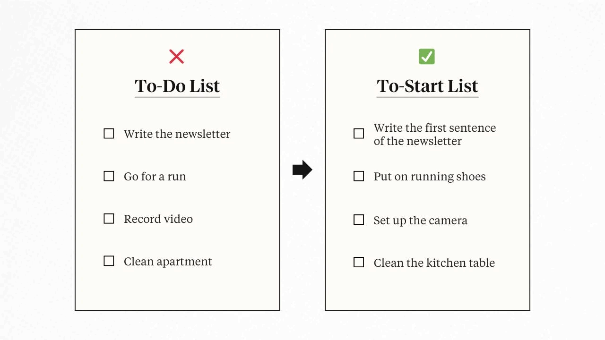

# Could-Do List → Should-Do List → Must-Do list

**

* **Could-Do**: The wide net — everything that seems interesting, aspirational, or vaguely useful. This is your idea garden. No judgment, just capture.
* **Should-Do**: A narrowed set — items that have passed a basic “is this actually important?” filter. They carry normative weight but lack the force of necessity.
* **Must-Do**: The critical few — what actually needs to happen. These are non-negotiable commitments with real consequences if left undone.

The real value of this framework is the explicit permission to let things stay in the “Could-Do” zone indefinitely. Not every seed needs to be planted.

---

# To-Do List → To-Start List

| Overwhelming Task | Minimum Viable Start |
|-------------------|---------------------|
| Write the newsletter | Write the first sentence |
| Go for a run | Put on running shoes |
| Clean apartment | Clean the kitchen table |
| Record video | Set up the camera |

---

# The “Open List” & The “Closed List”

|  | Open List (開放式清單) | Closed List (封閉式清單) |
|---|---------------------|----------------------|
| **Function** | Capture receptacle — a safe place where nothing gets lost | Commitment device — a finite container that forces prioritization |
| **Capacity** | Unlimited | Maximum ~10 entries |
| **Principle** | 分散原則 (distribution) — scattered across multiple capture tools | 集中原則 (centralization) — single list to concentrate attention |

**Workflow:**

1. Dump all tasks into the **Open List**
2. Transfer a subset (max ~10) to the **Closed List**

---

# 封閉式清單

[@forsterItTomorrowOther2008]

> “A closed list is a way of applying limits to our work in order to increase our efficiency.” — Mark Forster, Do It Tomorrow and Other Secrets of Time Management

## 概念

封閉式清單是一種設限的待辦清單，與開放式清單相反。它不允許隨意新增工作事項，這種方法能有效防止無限制的工作堆積，有效控制工作量。

封閉式清單的核心哲學與 [帕金森定律（Parkinson’s Law）](the-parkinsons-law.md) 相通。通過對清單容量設限，對抗人性中無止盡的擴張傾向。

## 使用方法

1. 前一天規劃：在前一天晚上列出明天需要完成的所有工作事項。
2. 設置界線：在清單的最後一項工作下方畫一條橫線，以明確區分計劃內與計劃外的事項。
3. 執行並專注：隔天按清單順序執行，盡量完成**橫線上方**的所有事項，避免臨時增加任務。
4. 記錄突發事項：如果有新的工作插入，先完成清單上的任務，再處理新工作，並將其記錄在**橫線下方** [^1]。同時，任何非必要的分心行為（如閒聊、瀏覽購物網站）也需記錄，以幫助回顧與優化時間管理。

---

# The Ivy Lee Method

by Charles Schwab

1. At the end of each work day, write down the six most important things you need to accomplish tomorrow. Do not write down more than six tasks.
2. Prioritize those six items in order of their true importance.
3. When you arrive tomorrow, concentrate only on the first task. Work until the first task is finished before moving on to the second task.
4. Approach the rest of your list in the same fashion. At the end of the day, move any unfinished items to a new list of six tasks for the following day.
5. Repeat this process every working day.

---

# [The Done List](https://www.oliverburkeman.com/donelist)

> “When you are anxious because of your to-do list take comfort in your have-done list.” — Kevin Kelly

| Dimension | Traditional To-Do List | The Done List |
|-----------|----------------------|---------------|
| **Framing** | Deficit — a gap you must close | Surplus — evidence of progress that accumulates |
| **Morning mindset** | Productivity Debt — owe the day’s work | Blank slate — fill it with completed tasks |
| **Psychology** | Anxiety about what’s unfinished | Momentum from what’s accomplished |
| **Self-signal** | “I am behind” | “I am someone who gets things done” |

---

# The “Stop-Doing” List

[@collinsGoodGreatWhy2001]

* “To-Don’t List” or “Anti To-Do List”
* **_Via negativa_** is essentially the study of what not to do

The Stop-Doing List is arguably more powerful than any to-do list, because **[subtraction is harder than addition.](addition-by-subtraction.md)** Every “yes” to something is a “no” to everything else, but we rarely make those trade-offs explicit.

Jim Collins’ research found that great companies had not just a clear sense of what they stood _for_, but also an equally clear sense of what they stood _against_. Applied personally: your productivity ceiling is often determined not by what you do, but by what you stop doing.

**Examples:**

| Stop Doing | Why |
|------------|-----|
| Checking email first thing in the morning | Starts the day reactively instead of proactively |
| Saying yes to meetings without an agenda | Wastes time without clear purpose or outcome |
| Multitasking | Reduces quality and increases switching costs |
| Reading news that doesn’t inform a decision | Consumes attention without actionable value |

---

# [Two Types of Checklists](https://sketchplanations.com/read-do-do-confirm-checklists)

| Aspect | Read-Do Checklist | Do-Confirm Checklist |
|--------|-------------------|---------------------|
| **When to use** | Unusual or unplanned scenarios | Normal, routine operations |
| **Process** | Read an item → do it → read the next | Perform from memory → then confirm with list |
| **Best for** | Unfamiliar or infrequent tasks | Familiar, frequently repeated tasks |
| **Examples** | Filing taxes, emergency procedures, onboarding | Daily routines, QA checks, habit tracking |
| **Risk it prevents** | Missing a step due to inexperience | Missing a step due to over-familiarity |

The type of list you need depends on your _relationship_ to the task, not the task itself. A familiar task can become unfamiliar after a long break; a novel task can migrate from Read-Do to Do-Confirm as competence grows.

---

# Gamification: Make It Fun; Make A Game Plan

[@bogostPlayAnythingPleasure2016] [@abdaalFeelGoodProductivityHow2024]

* To do lists = Anxiety inducing. (待辦清單 → 焦慮清單); Video game levels = Excitement inducing.
* **Fun doesn’t have to be enjoyable. Treat play as a pathway to focus. You don’t have to enjoy play.** Why? Because play can be a useful tool to hold our attention long enough to get the task done.

| Strategy | Mechanism | Example |
|----------|-----------|--------|
| **Enforce constraints** | Creates urgency that concentrates effort | Time limits, pomodoro, themed days |
| **Introduce variability** | Encourages curiosity through uncertainty | Random prompts, rotating environments |
| **Reframe as challenge** | Shifts emotional register from dread to determination | “Level 1: Write first paragraph” |

* **The Broaden-and-Build Theory:** Positive emotions broaden one’s awareness and encourage novel, exploratory thoughts and actions. Over time, this broadened behavioral repertoire builds useful skills and psychological resources.

Ian Bogost’s concept of _the pleasurable frustration of play_ is key here: good games are not _easy_ — they are _challenging in the right way_. A well-designed to-do system, like a well-designed game, should provide:

1. **Clear objectives** — you know exactly what “winning” looks like
2. **Immediate feedback** — checking off an item gives a small dopamine hit
3. **Progressive difficulty** — harder tasks after easier ones build momentum
4. **Optional constraints** — time-boxing, pomodoro, or themed days

[^1]: 或是背面。
