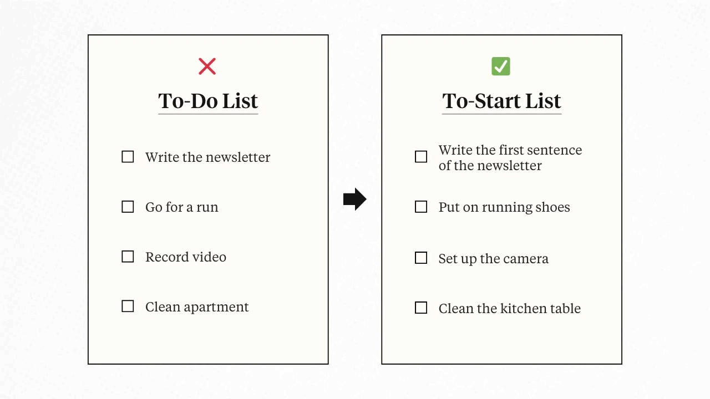

**Could-Do List → Should-Do List → Must-Do list
**

---

**To-Do List → To-Start List**

* Write the newsletter → Write the first sentence of the newsletter
* Go for a run → Put on running shoes
* Clean apartment → Clean the kitchen table
* Record video → Set up the camera

---

**The “Open List” and The “Closed List” (“集中” \& “分散” 原則)**

1. Dump all the tasks you need to do to the “Open List”
2. Transfer some tasks from the “Open List” to the “Closed List,” which has a maximum of ten entries — it’s a way to stay focused on what truly matters.

---

# 封閉式清單 [@forsterItTomorrowOther2008]

> _“A closed list is a way of applying limits to our work in order to increase our efficiency.” ― Mark Forster, Do It Tomorrow and Other Secrets of Time Management_

## 概念

封閉式清單是一種設限的待辦清單，與開放式清單相反。它不允許隨意新增工作事項，這種方法能有效防止無限制的工作堆積，有效控制工作量。

## 使用方法

1. 前一天規劃：在前一天晚上列出明天需要完成的所有工作事項。
2. 設置界線：在清單的最後一項工作下方畫一條橫線，以明確區分計劃內與計劃外的事項。
3. 執行並專注：隔天按清單順序執行，盡量完成<u>橫線上方</u>的所有事項，避免臨時增加任務。
4. 記錄突發事項：如果有新的工作插入，先完成清單上的任務，再處理新工作，並將其記錄在<u>橫線下方</u> [^1]。同時，任何非必要的分心行為（如閒聊、瀏覽購物網站）也需記錄，以幫助回顧與優化時間管理。

---

**[The "Done List"](https://www.oliverburkeman.com/donelist)**

* Why?
	* Many people seem to feel as if they start off each morning in a kind of “Productivity Debt”, which they must struggle to pay off through the day, in hopes of reaching a zero balance by the time evening comes.
* How?
	* Start with a blank slate each day and gradually fill it with completed tasks. It’s a helpful reminder of what you’ve accomplished, no matter how small. This helps build momentum.

---

**The “Stop-Doing” List [@collinsGoodGreatWhy2001]**
* “To-Don’t List” or “Anti To-Do List”
* _**Via negativa**_ is essentially the study of what not to do

---

# Gamification: Make It Fun; Make A Game Plan

[@bogostPlayAnythingPleasure2016] [@abdaalFeelGoodProductivityHow2024]

* To do lists = Anxiety inducing. (待辦清單 → 焦慮清單); Video game levels = Excitement inducing.
* **Fun doesn’t have to be enjoyable. Treat play as a pathway to focus. You don’t have to enjoy play.** Why? Because play can be a useful tool to hold our attention long enough to get the task done.
* How to make a task into play? How to add fun to a task?
	* Enforcing constraint (such as time limits) creates a sense of urgency that helps to concentrate efforts
	* Introducing variability encourages curiosity and engagement by exploring the uncertainties within a task
* **The Broaden-and-Build Theory:** Positive emotions broaden one’s awareness and encourage novel, exploratory thoughts and actions. Over time, this broadened behavioral repertoire builds useful skills and psychological resources.

[^1]: 或是背面。
