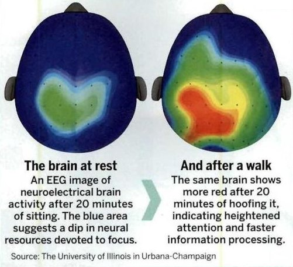
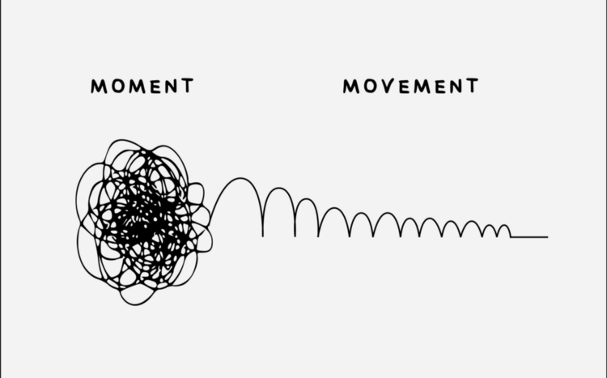

> _“Above all, do not lose your desire to walk. Everyday, I walk myself into a state of well-being & walk away from every illness. I have walked myself into my best thoughts, and I know of no thought so burdensome that one cannot walk away from it.” — Søren Kierkegaard_

---

---

**[Solvitur Ambulando: It Is Solved By Walking](https://sketchplanations.com/solvitur-ambulando)**

**Forward Ambulation** is another word to move forward - like taking a walk, biking or running!

**Incidental Exercise** is the physical activity required to engage in normal daily activities over the course of our day.

---

You’ll never regret taking a walk outside.

* Motion is lotion.
* Move to move the mind.

---

Goal: 8000–10000 steps per day

* 10 minutes of walking is around 1,000 steps

---

# Benefits

* generates [optic flow](optic%20flow.md)
* lowers activity in the [amygdala](amygdala.md), thereby reducing levels of [stress and anxiety](stress-and-anxiety.md)
* leads to focused alertness
* opens up the free flow of creative ideas — a thought process called [Divergent Thinking](Lateral%20Thinking.md)

# How To Get More Daily Walking Steps In?

* Walk for transportation
	* If you take a bus or train as part of your commute, getting off a stop or two earlier
* Try parking further
* Use stairs instead of elevators
* Take a 5-10 min post-meal walk
* Get a walking pad for a treadmill-desk setup

# Tips

* Walk alone or with someone else ([pair walking](https://www.google.com/search?q=pair+walking)). You can enjoy health benefits, plus enjoy your surroundings or enjoy a good conversation.
* Frequent, multiple, and brief walking breaks throughout the day are more effective at improving well-being than a single, longish walk — especially if you’re busy or get fatigued easily.
	* Devote _five minutes every hour_ to physical activity, whether you walk up and down a staircase, along a corridor or just pace around your office. [@bergouignanEffectFrequentInterruptions2016]
* Walk in nature (Park Walk) > Walk in urban (Street Walk) [@sellersTakeWalkPark2012] [@bratmanNatureExperienceReduces2015]
	* Walking in nature significantly reduced rumination (the act of dwelling on negative thoughts, replaying mistakes, or worrying about the future) and activity in the corresponding part of the brain, while those assigned to urban walks experienced no notable impact, highlighting the enhanced mental health benefits of natural environments.
* **Break Walks**
* **Active Walks:** I will often spend my active walks listening to an audiobook or podcast, or thinking about something specific that I want to work through (a problem, writing idea, etc.).
* **Passive “Tech-Free” Walks**
	* Passive walks are “atelic” [^1] activities (meaning they are done with no goal in mind). These walks are 30-60 minutes and are done at a slow, leisurely pace with no technology. Leave your phone at home. [Let your mind wander. Allow your ideas to mingle. I'd suggest bringing a little pocket notebook to log anything interesting that comes into your head (it will happen!).](creativity-is-just-connecting-things.md)
	* Raw dog your walks. When you go out for a walk, leave your phone behind—no calls, no music, no podcasts. Just you and your thoughts. It’s one of the best things you can do for your brain and mind, and I promise you’ll feel the difference.
	* Go on a walk without phone.
* Nordic Walking
* Walking Meditation
* Rucking: walking with weight on your back
	* [GORUCK](https://www.goruck.com/)

---

## See Also

* [Non-Exercise Activity Thermogenesis](Non-Exercise%20Activity%20Thermogenesis.md)

[^1]: 「有界」(bounded, telic) 和「無界」(unbounded, atelic)
