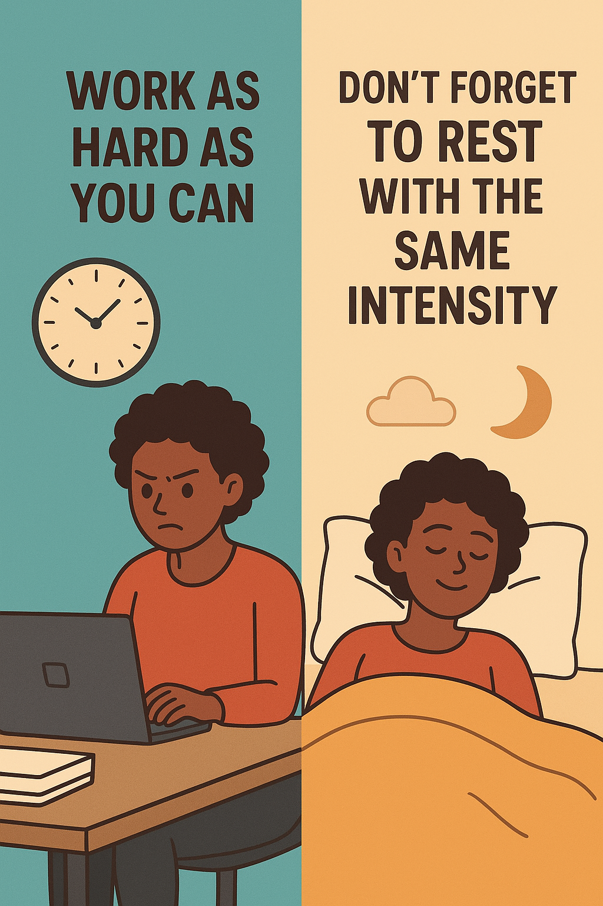

> “Without ambition one starts nothing. Without work one finishes nothing. The prize will not be sent to you. You have to win it.” — Ralph Waldo Emerson

> “Work hard until you no longer have to introduce yourself.”

> “Work hard in silence. Let your work make the noise.”

> “Hard work beats talent when talent doesn’t work hard.” — Tim Notke

> “The only thing that I see that is distinctly different about me is I’m not afraid to die on a treadmill. I will not be out-worked, period. You might have more talent than me, you might be smarter than me, you might be sexier than me, you might be all of those things you got it on me in nine categories. <mark>But if we get on the treadmill together, there’s two things: You’re getting off first, or I’m going to die. It’s really that simple, right? “You’re not going to out-work me. It’s such a simple, basic concept.</mark> The guy who is willing to hustle the most is going to be the guy that just gets that loose ball. The majority of people who aren’t getting the places they want or aren’t achieving the things that they want in this business is strictly based on hustle. It’s strictly based on being out-worked; it’s strictly based on missing crucial opportunities. I say all the time if you stay ready, you ain’t gotta get ready.” — Will Smith

> “I always tell people that this is a really simple deal: Work hard. If you work hard, follow what’s required and set your priorities right, then you can really perform without taking shortcuts. If you’re taking shortcuts, you can’t be free.” — Eliud Kipchoge

> “No matter what your ability is, effort is what ignites that ability and turns it into accomplishment.” — Carol S. Dweck, [Mindset: The New Psychology of Success](https://www.goodreads.com/work/quotes/40330)

---

[You can get to the top-10% by either working hard OR smart, but you can only reach the top-1% by working hard AND smart.](https://blog.samaltman.com/how-to-be-successful)

---

---

[Working hard isn’t just about attitude. Working hard and trying your best every time is a skill that can be trained and practiced.](https://youtu.be/L_l9-bpvW5c?t=2939s)

---

Working hard for something we don’t care about is called **stress**. Working hard for something we love is called **passion**.

---

 Assiduity: Sit down and do it until it’s done.

---

You don’t get the things you dream of, you get the things that you work for.

---

殫精竭慮

---

你必須很努力，才能看起來 [毫不費力](sprezzatura.md)。

---

勞動是社會中每個人不可避免的義務，沒有勞動就不會有正常人的生活。勞動是快活的根源。

---

> [“Nobody tells this to people who are beginners, I wish someone told me. All of us who do creative work, we get into it because we have good taste. But there is this gap. For the first couple years you make stuff, it’s just not that good. It’s trying to be good, it has potential, but it’s not. But your taste, the thing that got you into the game, is still killer. And your taste is why your work disappoints you. A lot of people never get past this phase, they quit. Most people I know who do interesting, creative work went through years of this. We know our work doesn’t have this special thing that we want it to have. We all go through this. And if you are just starting out or you are still in this phase, you gotta know its normal and <mark>the most important thing you can do is do a lot of work. Put yourself on a deadline so that every week you will finish one story. It is only by going through a volume of work that you will close that gap, and your work will be as good as your ambitions.</mark> And I took longer to figure out how to do this than anyone I’ve ever met. It’s gonna take awhile. It’s normal to take awhile. You’ve just gotta fight your way through.” — Ira Glass](https://youtu.be/E1oZhEIrer4) [^1]

There will always be a gap between where you are and where you want to be. And the bridge between that gap is [courage](courage-is-knowing-what-not-to-fear.md). The courage to look foolish in the beginning. The courage to show up again when your early work is criticized. The courage to look yourself in the mirror and say, “I realize I’m not good enough yet, but the only way to get better is to keep working on it.”

[Nibble and your appetite will grow — Steph Ango](https://stephango.com/nibble)

---

# Heaven’s Reward Fallacy

Humans tend to have an expectation that…

* they will be justly rewarded and praised for all of their hard work and sacrifice.
* there will be a reward in the end if they sacrifice enough, work hard enough, and struggle hard enough that.

---

Work as hard as you can, but don’t forget to rest with the same intensity.

---

# 擇你所愛，愛你所擇

> [“Your first task is to find what feels effortless to you. Your second task is to put maximum effort into it.” — James Clear](https://jamesclear.com/3-2-1/may-22-2025)

> “You have to work hardest for the things you love most.” — Carol S. Dweck

[^1]: 眼高，也要手高
