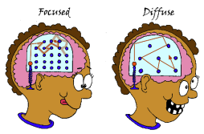

> _“If you want to operate at maximum [productivity](Productivity.md), efficiency, and creativity, you’re going to work on things that you’re excited about at the moment you’re excited about them and accept nothing less. It is better to [sit on your butt and do nothing](boredom-promotes-creativity.md) than it is to work on things that you are not excited about.” — Naval Ravikant_ [^1] [^2]

> “The right way to work is like a lion. You don’t — you and I are not like cows. We’re not meant to graze all day, right? We’re meant to hunt like lions. So, as a modern knowledge worker, an intellectual athlete, you want to function like an athlete. This means you train hard, then you sprint, then you rest, then you reassess. You get your feedback loop, you train some more, then you sprint again, then you rest, then you reassess. This idea that you’re going to have linear output just by cranking every day at the same amount of time sitting — that’s machines. Machines should be working 9 to 5. Humans are not meant to work 9 to 5.” — Naval Ravikant

---

Humans are not machines.

---

[能量/精力管理](energy-management.md) \> [時間管理](time-management.md)

Why?

* 時間是有限的 [^3]，但 [能量或精力可以無限](energy-management.md)
* 時間以不變的速度流逝，但能量或精力不斷地在變。

---

# [The Ultradian Rhythm](https://youtu.be/yb5zpo5WDG4?t=1575)

* originated from “Basic Rest-Activity Cycle” by Nathan Kleitman
* is a recurrent period or cycle repeated throughout a 24-hour day.
	* Ultradian = “many times a day”
	* Circadian = “about a day” [^4]
* is a biological fact that our alertness naturally rises and falls in 90‑minute cycles
	* Aim for 1–3 × 90-minute intervals per day.
		* 4 × 90-minute blocks of focused work per day, while possible, is highly unusual.
		* Go to a deliberate [defocus](the-most-productive-people-prioritize-intentional-rest.md) for 10-30 minutes after each of 90-minute [deep work](deep-work.md) bout.
	* [Ultra Focus Odyssey = UFO](https://shosho.tw/blog/super-productivity-system-2024)

---

# 在對的時間做對的事情

> “Focus on being productive instead of busy.” — Timothy Ferriss, [The 4-Hour Workweek](https://www.goodreads.com/work/quotes/1885647)

**Choose [the right task](two-types-of-work.md) at the right time / Put your time in the right places**

|                    |
| :-------------------------------------------------------------------------: |
| [Source](https://barbaraoakley.com/books/learning-how-to-learn) |
|                                                                             |

# Match energy level with tasks

* Phase 1 (0–8 hours after waking up) - **Focused Mode**
	* optimal for analytic “hard” thinking and [any work that you find particularly challenging](eat-the-biggest-frog-first-thing-in-the-morning.md)
	* 戰鬥時間 → 登峰造極時刻 ([Deep Work](deep-work.md))
* Phase 2 (9–16 hours after waking up) - **Diffused Mode**
	* optimal for brainstorming and creative work
	* 戰略時間

[@valdezCircadianRhythmsAttention2019]

There are specific times during the day that are for optimal goal work. According to [a review by Dr. Pablo Valdez in the Yale journal Biology and Medicine](https://www.ncbi.nlm.nih.gov/pmc/articles/PMC6430172/), there are three peak times each day when our attention and focus are at their highest. As a rough guide, **30 minutes, 3 hours, and 11 hours after you wake up** are great times for hard work. This happens because of the body’s circadian rhythm (sleep-wake cycle) and rhythmicity of body temperature and associated neurochemicals.

**Biological Prime Time (生理黃金時段)** is the time of day when you feel most alert, energized, and productive in accomplishing your tasks.

---

[@davisTwoAwesomeHours2015]

[Productivity](Productivity.md) isn’t about working longer or harder but about making the most of a few truly effective hours each day. Trying to power through the entire day at the same intensity is ineffective, [making strategic breaks and rest periods essential for sustained high performance](the-most-productive-people-prioritize-intentional-rest.md). By structuring our day around peak cognitive capacity rather than sheer effort, we can maximize efficiency while avoiding [burnout](Burnout.md).

---

# [The Productivity Pendulum](https://aliabdaal.com/newsletter/the-productivity-pendulum/)

> Productivity and creativity are two sides of the same coin (pendulum). They complement and enhance each other. Both should be balanced as excessive focus on either end of the spectrum can lead to [diminishing returns](https://en.wikipedia.org/wiki/Diminishing_returns).

---

Life has four speeds: 1) Rest, 2) Walk, 3) Sprint, and 4) Jog. Most of us default to “jog”—we work steadily, pushing through long hours at a moderate pace. To go further and faster, we should switch our default to either rest, walk, or [sprint](the-pomodoro-technique.md). The rhythm is simple: _rest, walk, sprint, repeat_. There’s no place for “jogging.”

---

Work like a lion. [^5] [^6] [^7] Eat like a snake. Sleep like a baby.

---

# Work At A Ten, Not A [Simmering Six](https://www.google.com/search?q=Simmering)

> “[Most people in high-stress, decision-making industries are always operating at this kind of simmering six, or four, as opposed to the undulation between just deep relaxation and being at a 10. Being at a 10 is millions of times better than being at a 6. It’s just in a different universe.](https://tim.blog/2019/06/27/josh-waitzkin/)” — Josh Waitzkin

---

# [More Intensity, Less Duration](https://www.inc.com/jessica-stillman/the-secret-to-happiness-at-work-less-duration-more-intensity.html)

A productivity study conducted by the [Draugiem Group](https://draugiemgroup.com/) using the [DeskTime](https://desktime.com/) time-tracking app suggests that, the optimal work-to-break ratio is **52 minutes of sprinting followed by 17 minutes of utter [relaxation/recuperation](the-most-productive-people-prioritize-intentional-rest.md)**.

According to the research, “_The secret to retaining the highest level of productivity over the span of a workday is not working longer–but working smarter with frequent breaks._” The most productive 10 percent of employees “_make the most of those 52 minutes by working with intense purpose, but then rest up to be ready for the next burst. In other words, they work with purpose. Working with purpose can also be called the ‘100 percent dedication’ theory–the notion that whatever you do, you do it full-on._” [^8] [^9]

---

# 精神時光屋

《七龍珠》中的一個奇異修煉空間（「專注之繭」），內部時間流逝速度比外界快很多，約為「外界一天，裡面一年」。

這個梗常用來比喻需要在某個地方進行極為嚴格、密集的訓練，以在短時間內獲得巨大實力提升、快速進步的場合，例如考試前的衝刺或電競選手的特訓。

---

[Parable of the Two Watchmakers](parable-of-the-two-watchmakers.md)

---

[Visual Perceptual Exercise](visual-perceptual-exercise-by-andrew-huberman.md)

---

[What you work on is far more important than how productively you work](what-you-work-on-is-far-more-important-than-how-productively-you-work.md)

---

[You can achieve anything if you focus on one thing at a time](you-can-achieve-anything-if-you-focus-on-one-thing-at-a-time.md)

[^1]: “wait-and-see mode”
[^2]: Naval Ravikant 認為，若想達到生產力、效率與創造力的巔峰，就必須在對事物感到興奮的當下全力以赴。寧願什麼都不做，也不要浪費時間在沒熱情的事情上。
[^3]: 每個人每天都是固定 24 小時
[^4]: **Circadian Rhythm (= 生理時鐘 = 晝夜節律):** Every cell/organ in our body/brain is modulated or changes in a very regular and predictable rhythm across the 24-hour day.
[^5]: Don’t work like a cow, standing in the field all day, grazing grass at a slow pace—move with the precision of a hawk or the focus of a lion stalking its prey.
[^6]: [Why is Lionel Messi always walking during matches?](https://www.reddit.com/r/InterMiami/comments/15x8xvh/why_does_messi_walk_alot_well_here_you_go/)
[^7]: [LeBron James walks a lot. During the regular season, about 74.4 percent of James' time on the court was spent walking. Again, this was in the top 10 in the league. Almost no one walked up and down the floor more than James. And in the playoffs, he’s walking even more—8.7 percent of the time.](https://www.espn.com/nba/story/_/id/23384071/lebron-james-plays-rests-keep-cleveland-cavaliers-hopes-alive)
[^8]: Draugiem Group’s study found that the most effective workers didn’t adhere to rigid 8-hour shifts or short breaks every hour. Instead, they alternated between productive 52-minute sessions and restorative 17-minute breaks, allowing their brains to stay fresh and efficient.
[^9]: The most productive workers weren’t the ones who chained themselves to their desks for eight-hour days, nor those who took a seemingly healthy five-minute break every hour. Instead, they discovered that working in 52-minute bursts, followed by 17-minute breaks, allowed their brains to recharge, maximizing focus and productivity for the next session.
