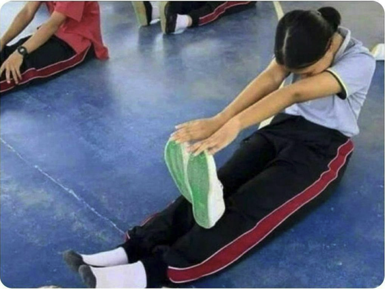

> “You’re more likely to unlock a big leap in performance by trying differently than by trying harder. You might be able to work 10% harder, but a different approach might work 10x better. Remain focused on the core problem, but explore a new line of attack. Persistence is not just about effort, but also strategy. Don’t merely try harder, try differently.” — James Clear

> “A fanatic is one who redoubles his effort when he has forgotten his aim.” — George Santayana

> “I choose a lazy person to do a hard job. Because a lazy person will find an easy way to do it.” — Bill Gates

---

_“The Lizard had the tree in mind when challenging the Dog to a fight.”_

> “You have to [work hard](https://jamesclear.com/3-2-1/december-26-2024) to discover how to [work smart](../../..//Evergreen-Notes/Permanent-Notes/work-smart.md). You won’t know the best solutions until you’ve made nearly all the mistakes.” — James Clear [^1]

Often, strategy outweighs sheer effort.

Never press the “Try/Grind Harder” button. Instead, build a sustainable _[systems](systems-over-goals.md)_ for achieving _[goals](goal-setting.md)._

---

[Refuse to feel rushed.](slow-down-to-speed-up.md) This becomes possible by deeply understanding your [priorities](prioritization.md).

* 從容不迫
* 不疾不徐

---

[“No pain, no gain.” → “With pain, less gain.”](https://www.ryanhoover.me/post/the-fallacy-of-no-pain-no-gain)

---

# 不必使盡全力，用四分之三的氣力做事就夠了

> [別太認真 = 專注且放鬆。](https://youtu.be/T0hKmjsnGSs?t=20m25s)

* 用四分之三的氣力完成一件作品或是一件事的成果才是最好的。
* 因為使盡全力完成的東西，只會讓人覺得沉重、緊繃不已，也會散發一股「世故味」。
* 相反的，用四分之三的氣力完成的東西，不但讓人感覺從容，也能給人安心、舒適的印象。

[The Law of Reversed Effort](the-law-of-reversed-effort.md)

---

# [“Hard Work → Hard Thinking” by James Clear](https://x.com/JamesClear/status/1382433293686210568)

We need to redefine “[hard work](work-hard.md)” to include “[hard thinking.](planning-and-preparation-help-maximize-your-productivity.md)”

* The person who outsmarts you is out working you.
* The person who finds shortcuts is out working you.
* The person with a better strategy is out working you.

Usually, the hardest work is thinking of a better way to do it.

---

[99% of effort is wasted](99-percent-of-effort-is-wasted.md)

---

[Slow down to speed up](slow-down-to-speed-up.md)

---

[What you work on is far more important than how productively you work](what-you-work-on-is-far-more-important-than-how-productively-you-work.md)

[^1]: See also: [Specialization is for insects](specialization-is-for-insects.md)
