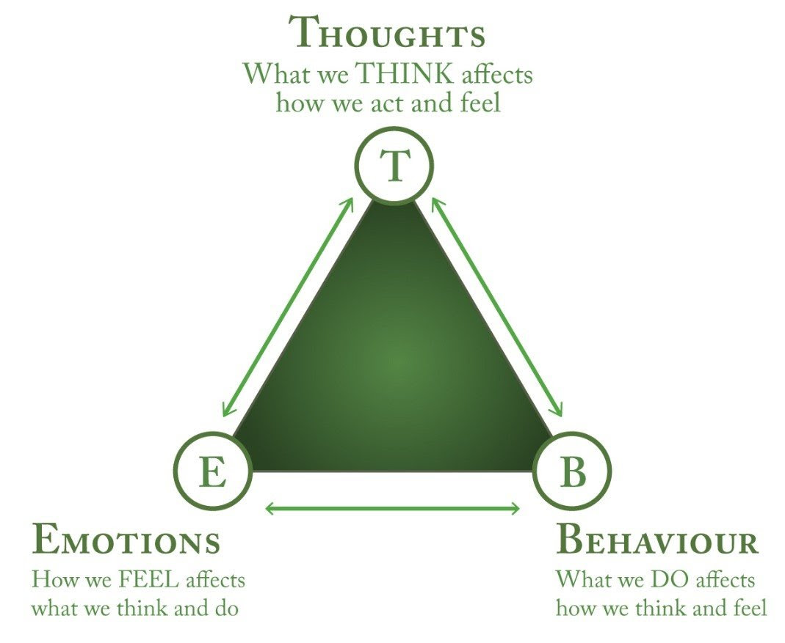

> “The bad workouts are the most important ones. It’s easy to train when you feel good, but it’s crucial to show up when you don’t feel like it—even if you do less than you hope. Going to the gym for 15 minutes might not improve your performance, but it reaffirms your identity. **It’s not always about what happens during the workout. It’s about becoming the type of person who doesn’t miss workouts.**” — James Clear

> “The more you repeat a behavior, the more you reinforce the identity associated with that behavior. In fact, the word _identity_ comes from the Latin words _essentitas_, which means _being_, and _identidem_, which means _repeatedly_. Your identity is literally your _repeated beingness_.” — James Clear, Atomic Habits

---



---

> “We are what we believe we are.” — C.S. Lewis

Your identity is the label that defines “_Who You Are._” [^1]

---

# Your Identity Dictates Your Action. Your Belief Drives Your Behavior.

> “Every action you take is a vote for the type of person you wish to become. No single instance will transform your beliefs, but as the votes build up, so does the evidence of your new identity. This is one reason why meaningful change does not require radical change. Small habits can make a meaningful difference by providing evidence of a new identity. And if a change is meaningful, it is actually big. That’s the paradox of making small improvements.” — James Clear, [Atomic Habits: An Easy & Proven Way to Build Good Habits & Break Bad Ones](https://www.goodreads.com/work/quotes/62221762)

Every action you take sends a signal to your brain about the kind of person you are.

[It is easier to act yourself into a new way of thinking, than it is to think yourself into a new way of acting.](action-precedes-motivation.md)

It’s also a lot easier to [change direction](adaptability.md) when you’re moving forward than when you’re static.

The psychologist [William James](https://www.google.com/search?q=William+James) observed that action and feeling go hand in hand: to become a certain kind of person, you must first _[act](cultivate-a-strong-bias-towards-action.md)_ like that person. This is the foundation of the **[identity-based habits](https://www.google.com/search?q=identity-based+habits)**: instead of focusing on _what_ you want to achieve, focus on _who_ you wish to become.

**Examples:**

| If you want to become… | The identity | The tiny action that reinforces it |
| ---------------------- | ------------ | ---------------------------------- |
| Someone who reads more | A reader     | Read one page before bed           |
| Someone who exercises  | An athlete   | Put on your workout clothes        |
| Someone who writes     | A writer     | Write one sentence daily           |
| Someone who meditates  | A meditator  | Sit for one minute each morning    |

Each repetition is a vote for your desired identity. Missed days are votes against it. You don’t need a perfect record — you just need to ensure your votes for the new identity outnumber your votes for the old one.

## The Identity-Action Feedback Loop

```text
Belief → Identity → Action → Evidence → Reinforced Belief
```

1. **You adopt a belief** about who you are (“I’m the kind of person who exercises”).
2. **That belief shapes your identity** — you see yourself as someone who exercises.
3. **Your identity drives your actions** — you go to the gym even when you don’t feel like it.
4. **Your actions produce evidence** — you exercised today, proving to yourself that you are indeed an exerciser.
5. **The evidence reinforces your belief** — the cycle strengthens.

This loop explains why **[small, consistent actions compound into profound identity shifts](the-one-percent-rule.md)**.

---

# Turning Values into Time

_Values are attributes to the type of person you want to become._

To identify someone’s values, observe:

* **Their calendar**: How they spend their time.
* **Their account book**: How they spend their money.

Your calendar and bank statement are — together — the most honest autobiography you will ever write. They do not lie about what you truly value. If you claim to value health but never schedule exercise, or claim to value learning but never buy books, your actions reveal your actual priorities with brutal clarity.

Actionable Steps:

1. **Define Your Values**:
	* Ask yourself: _“What kind of person do I want to be?”_
	* Go deeper: Write down 3–5 identity-based statements starting with “I am the kind of person who…” (e.g., “I am the kind of person who prioritizes deep work over shallow distractions.”)
2. **Turn Your Values Into Your Time/Expenses**:
	* Ask yourself: _“How would the person I want to become spend their time and money?”_
	* Using your values as a guide to scheduling your time and making financial decisions.
	* **Practical technique**: At the start of each week, block time for your top values before anything else. If health is a value, your workout gets scheduled on Monday morning — not squeezed in “when you have time.”
3. **Track and Reflect**:
	* Regularly review your calendar and spending habits to ensure they align with your values. Use this as a guide to plan your day and make decisions about your schedule.
	* **Weekly audit**: Every Sunday, spend 10 minutes asking: _Did my calendar reflect my values this week? Where did I drift? What one adjustment will bring next week into better alignment?_

## The Values Cascade

Your values cascade down into ever more concrete decisions:

```text
Values  →  Identity  →  Priorities  →  Schedule  →  Daily Actions
```

A misalignment anywhere in this cascade produces friction. If your values say “health” but your schedule has no room for exercise, the problem is not a lack of willpower — it is a cascade breakdown. Fix the schedule, and the behavior follows.

---

# [The Stonecutter Principle](https://www.sahilbloom.com/newsletter/the-stonecutter-principle)

> A traveler approached three stonecutters working on a construction site and asked each of them what they were doing.
>
> The first stonecutter said, “I am cutting stone.”
>
> The second stonecutter replied, “I am building a wall.”
>
> But the third stonecutter smiled proudly, “I am building a cathedral.”

Same work. Different story.

The _task_ doesn’t change, but the _meaning_ does.

[The story you tell yourself](be-careful-how-you-are-talking-to-yourself.md) dictates your daily actions.

The third stonecutter’s identity — cathedral-builder rather than stone-cutter — transforms a mundane, repetitive task into a purposeful contribution to something larger than himself.

**How to apply the Stonecutter Principle:**

1. **Name your cathedral**: What larger purpose does your daily work serve? Write it down in one sentence. _“I am not writing code; I am building tools that help people learn.”_ [^2]
2. **Connect the task to the identity**: Before starting any task, silently complete this sentence: _“By doing this, I am becoming the kind of person who…”_
3. **Use the principle on hard days**: When motivation is low, zoom out from the stone and visualize the cathedral.

> “What look like differences in natural ability are often differences in opportunity and motivation.” — Adam M. Grant, [Hidden Potential: The Science of Achieving Greater Things](https://www.goodreads.com/work/quotes/170223349)

---

# The Identity-Willpower Paradox

You will rarely outperform your self-image.

This is one of the most consequential insights in behavioral psychology. If your self-image says you are “not a morning person,” no amount of alarm clocks will sustainably make you wake up early — because every early morning contradicts your identity.

The energy required to override your identity (willpower) is finite. The energy that flows from aligning with your identity is boundless.

**The paradox**: The very act of relying on willpower to change a behavior often reinforces the identity you are trying to escape. Saying “I’m trying to quit sugar” reinforces the identity of a sugar-eater who is currently abstaining. Saying “I don’t eat sugar” (notice the identity-based language) reframes the behavior as simply _who you are_.

| Identity-undermining language | Identity-reinforcing language |
|---|---|
| “I’m trying to read more.” | “I’m a reader.” |
| “I can’t run very far.” | “I’m a runner who is building endurance.” |
| “I’m on a diet.” | “I’m someone who eats nourishing foods.” |
| “I should meditate.” | “I’m a meditator — this is what I do.” |

---

[Character is who you are when nobody’s watching](character-is-who-you-are-when-nobodys-watching.md)

[^1]: “It’s part of who I am.”
[^2]: Related: [The Enactment Effect](https://www.google.com/search?q=The+Enactment+Effect)
